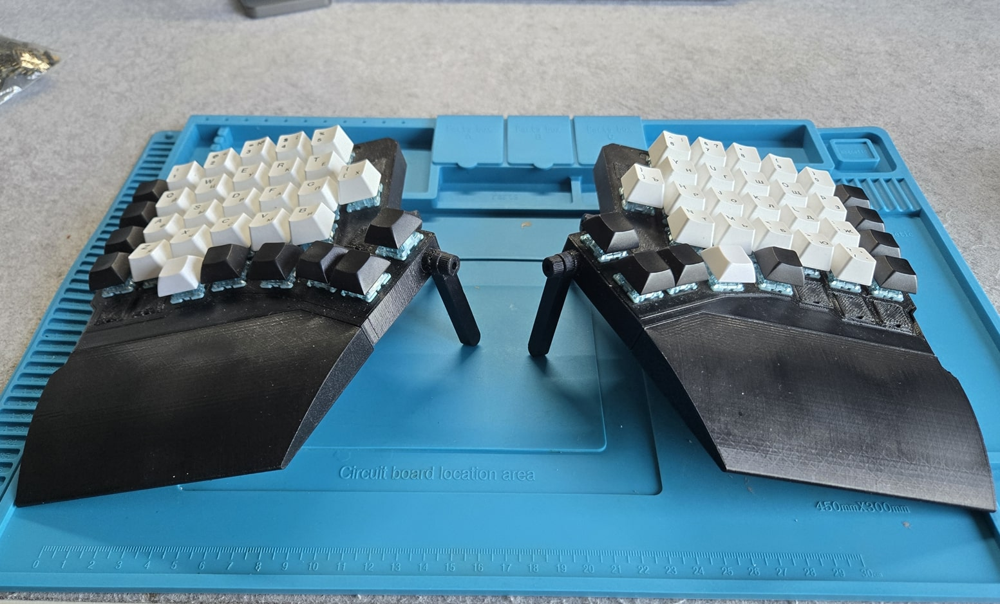
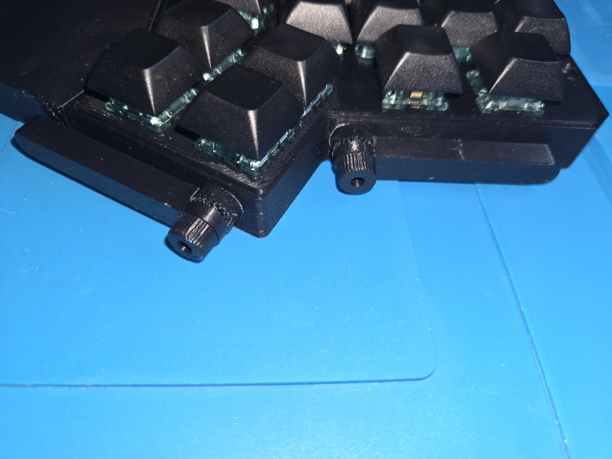

# Case for a Wireless Redox Rev1 Keyboard

Case for a [Redox keyboard](https://github.com/mattdibi/redox-keyboard/tree/master/redox) with Wristrest and Tenting, built from scratch but inspired by [Original Mattdibi Case](https://github.com/mattdibi/redox-keyboard/tree/master/redox/case), [Neodox Case](https://github.com/Pastitas/Redox-neo-Case) and [Ergodox Keyboard](https://ergodox-ez.com/).

This case is built for a **Wireless** Rev1 with use of [Nice!Nano V2](https://nicekeyboards.com/nice-nano/) MCU (Or its alternatives. In my case - [ProMicro NRF52840](https://www.elecrow.com/pro-micro-nrf52840-development-board-compatible-with-nice-nano-v2-0.html)).

**TL;DR:** [Assembly Guide](#assembly)

## Table of Contents
* [Bill of Materials](#bill-of-materials)
* [PCB Prerequisites](#pcb-prerequisites)
  * [Differences & Requirements](#differences--requirements)
* [Assembly](#assembly)
  * [Bottom](#bottom)
  * [Top](#top)
  * [Tenting](#tenting)
  * [Wrist Rest](#wrist-rest)
  * [Final Touches](#final-touches)
* [Contributions](#contributions)
* [To Be Done](#to-be-done)

---

---
## Bill of Materials

| Item                                           | Image                                  | Quantity                | Description                                                                                                                                                                                            |
| ---------------------------------------------- | -------------------------------------- | ----------------------- | ------------------------------------------------------------------------------------------------------------------------------------------------------------------------------------------------------ |
| LiPol 3.7V Battery 403040 or thinner (500 mAh) |               | 2                       |                                                                                                                                                                                                        |
| JST-XH PH 1,25 2-pin connectors                |         | 2 pairs                 | Used to connect batteries to a PCBs  Part of a `PCB Prerequisites`                                                                                                                               |
| Micro Slide Switch Spdt SS12F15                |          | 2                       | [AliExpress](https://aliexpress.ru/item/1005003938856402.html?sku_id=12000027515454290)  Part of a `PCB Prerequisites`                                                                           |
| MCU Hot-Swap Female connector                  |  | 48 pins                 | [Amazon](https://www.amazon.in/Single-Headers-Machine-Female-2-54mm/dp/B0187LTEX2)  Part of a `PCB Prerequisites`                                                                                |
| RGB 4-pin Male connector                    |    | 24 pins                 | [AliExpress](https://aliexpress.ru/item/1005006655092258.html?gatewayAdapt=glo2rus&sku_id=12000037934700782) Remove plastic holder, cut each pin in two halves  Part of a `PCB Prerequisites` |
| M3x8 Screw                                  |              | 12                      | Used in a tight space. Use Hex or Phillips screws. Do not use screws made for a wrench.                                                                                                                |
| M3x2.5 Nut                                     |                                        | 12 (14 with Wrist Rest) |                                                                                                                                                                                                        |
| M3x16 Screw                                 |         | 0 (2 with Wrist Rest)   | Used only in a Wrist Rest                                                                                                                                                                              |
| M2 Nut                                         |                                        | 2                       | Used to fix Power Switch                                                                                                                                                                               |
| M2x4 Screw                                     |                                        | 2                       | Used to fix Power Switch. Can be longer.                                                                                                                                                               |
| Hot Glue                                       |                                        | -                       | Need a few places, to fix some elements. Can be done without it, but not recommended.                                                                                                                  |
| Silicon pads 9x1.5 (Or thicker if you want)    |                                        | 8 (12 with Wrist Rest)  |                                                                                                                                                                                                        |

## PCB Prerequisites

> [!WARNING]
> Guide below assumes you have assembled PCB.
> This section describes how my PCB looked like when I did assemble the case.
> Minor differences should be fine, but case was only tested with described PCB.

Original PCB assembly guide: https://github.com/mattdibi/redox-keyboard/tree/master/redox#assembly-guide

---

#### Differences & Requirements:

* PCB must have Hot-Swappable switches (see https://github.com/mattdibi/redox-keyboard/tree/master/redox#hot-swappable-switches) - required by `Top` part of the case. *You can workaround this requirement by extending "switch holes" on a `Top` part* 

* I also made a Nice!Nano MCU hot-swappable. 

* Solder 2-pin battery connector with power switch, breaking a `+` wire. 
	* `-` wire should be soldered to a `ground` (or `Battery-` if you prefer). I choose this convenient place: 
	* `+` wire should be soldered to a `Raw` (or `Battery+` if you prefer) pin of MCU: 

* Solder 2-pin connector to a batteries: 

## Assembly

> [!NOTE]
> Following instructions describes assembly of one half. Since Redox halves are symmetric, these instructions are applied to another half as well, with only one requirement - printed models should be mirrored.

Total printed parts to assemble **one half**:
* `Bottom.stl` - 1 pcs;
* `Top.stl` - 1 pcs;
* `Wristrest.stl` - 1 pcs;
* `Reset_button.stl` - 1pcs;
* `Tent_leg.stl` - 2 pcs (1 + 1 mirrored);
* `Tent_knob.stl` - 2 pcs.

---
#### Bottom

> [!TIP] 
> You can build the case WITHOUT a Wristrest. For that, you need to hide `Bottom -> Bodies -> 'Wristrest base'` body in a source project (`.f3z` - Fusion 360 project).

> [!WARNING]
> Asymmetric USB port problem. Expand to see more

Asymmetric USB port problem

	
> Nice!Nano was asymmetrical USB port. Because of that, RIGHT half might not fit into the case.
> Possible solutions:
>   * Print RIGHT `Bottom.stl` 2.5 mm thicker;
>   *  Heat bottom, where USB port will be located and deform it a little (See pics below).
>      
>      

* Print **one** `Bottom.stl`.
* Print **one** `Reset_button.stl`.
* Use drop of a Hot Glue to fix the battery in place. *Position is not important, I just prefer it at the outer side.* 
* Put `M3 Screws` in a tenting base. Fill remaining space with a hot glue. *Using hot glue is highly recommended - otherwise you'll have hard times putting knobs on that screw.*  

* Put `Reset button` in according slot. 

* Put the `Power Switch`, which is a part of the PCB, in according slot. Fix it using `two M2 screws` and `two M2 nuts`.  

* Connect battery to a PCB.
* Place the PCB. 

---
#### Top

* Print **one** `Top.stl`.

* Place `Top` on top of a PCB, closing the case. 
* Screw the case using `four M3 screws` and `four M3 nuts`. I suggest to put `M3 nuts` in a `Top` holes.

Now you can finish the keyboard by adding `Switches` and `Keycaps`.

---
#### Tenting

* Print **two** `Tent_leg.stl`: one - as is, another - optionally mirrored.
* Print **two** `Tent_knob.stl`.

* Take `two M3 Nuts` and place them into the `Tent_knobs`. Optionally, glue them (Usually not required - it depends on a printer tolerance).

* Take `Tent_legs` and place them accordingly. Fix them using `Tent_knobs`. 

---
#### Wrist Rest

* Print **one** `Wristrest.stl`. See the picture below for a suggested slicing. Tree support is **highly recommended** - with `Normal Support` it is almost impossible to clean a nut slot.

* Put `one M3 Nut` in a nut slot.
* Take `one Long M3 Screw` and screw it. 

* Slide `Wristrest` into the `Wristrest base`. To fix the Wristrest, twist the screw to the end. 

---
#### Final touches

* Glue silicon pads in according slots 

## Contributions

I am just a guy, who is quite far from a professional CAD user, so I appreciate any advice/contribution/remix.

I tried to introduce some parameters in model, but there is a big chance they are not working properly (See [To Be Done](#to-be-done) section).

## To Be Done

* Test and fix the model parameters - IDK if changing current parameters won't break whole model;
* Check the possibility to use M3 instead of M2 for a Power Switch;
* Make case thinner: move battery into the wristrest + check how to make a thinner hot-swappable MCU. Approx. thickness reduction: 2.5-3mm;
* <?> Adapt model to a **Wired** Redox.
